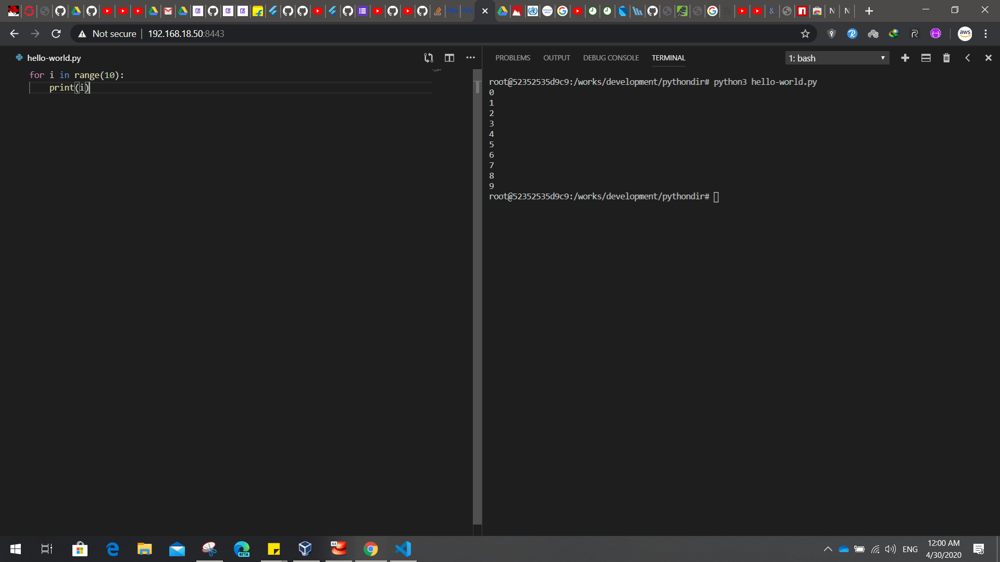

(1) run a docker image.
 
```
git clone https://github.com/anantjakhmola/Docker_project.git
# Navigate to file location 
docker build . -t  python_ide
docker run -p 8443:8443 -p 8080:8080 -it python_ide bash
```

(2) run vscode at code-server

```
/works/code-server /works/development/pythondir  --allow-http --no-auth
```

(3) and open 'http://127.0.0.1:8443/' at your browser / You can also use IP address of compputer



